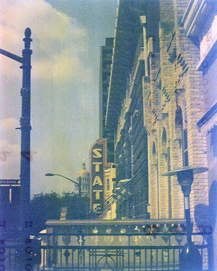
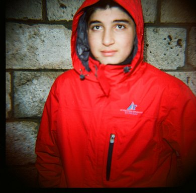
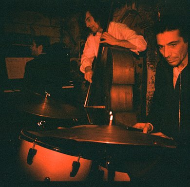
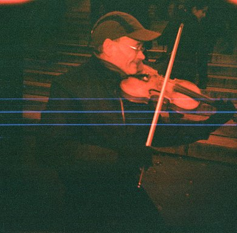

# Lomography Film Album Catalog

## Purpose

Catalog Lomography albums that represent film photography evidence across the lens archive. This entry separates 35mm Lomography plastic-camera albums, 120 film work including Agfa Isolette and Diana F+ albums, and other film formats as they surface.

## Best of Film Work

This first-pass selection is meant to behave like a portfolio doorway into the film archive: five images that show range across 120 film, 616 film, street portraiture, live music, and redscale mood work. Local image copies are stored under `05_the_lens/assets/lomography/best-of-film-work/`; each selection keeps its Lomography source link for provenance.

### Dance Silhouette

Source: [Dance / photo 21832746](https://www.lomography.com/homes/texasredd/albums/2137404-dance/21832746)

This is the cleanest fine-art frame in the first curation pass: strong silhouette, beautiful negative space, and a body shape that reads immediately through the softness of the Isolette/120 look.

### Kodak Bellows State Theatre

Source: [Kodak Six-Three Pocket Bellows / photo 14651055](https://www.lomography.com/homes/texasredd/albums/1773045-kodak-six-three-pocket-bellows-circa-1913/14651055)

This carries the artifact quality of the archive especially well. The camera age, color drift, vertical sign, and architectural edge make the image feel like an object from another time.

### Street Style Red Jacket

Source: [Street Style / photo 12953787](https://www.lomography.com/homes/texasredd/albums/1691772-street-style/12953787)

This is the strongest human portrait from the first pass. The direct gaze, simple color story, and imperfect Diana F+ edges keep the frame intimate without making it feel overworked.

### Caveau Drummer

Source: [Caveau de la Huchette / photo 12952670](https://www.lomography.com/homes/texasredd/albums/1691678-caveau-de-la-huchette/12952670)

This is the strongest "inside the room" documentary frame from the jazz/performance work: warm, close, active, and loose in a way that matches the subject.

### Paris en Rouge Violinist

Source: [Paris en Rouge / photo 12952511](https://www.lomography.com/homes/texasredd/albums/1691668-paris-en-rouge/12952511)

The redscale palette works hard here in a good way. It gives the frame a nocturnal, remembered quality while the violinist gives the abstraction a clear human anchor.

## Format Notes

- `Isolette - First Shots` and `X-Mas 2016 Smithville -> Sacramento Road Trip` represent 120 film work from the 1961 Agfa Isolette.
- `Dance` represents 120 film work from the 1961 Agfa Isolette.
- `New Orleans Oct 2016` represents 120 film work.
- `Kodak Six-Three Pocket Bellows (circa 1913)` represents Kodak 616 film work.
- `Smithville, TX` is mixed format: black-and-white images are 120 film, and all other images are 35mm film.
- `SXSW 2011 - Part 1` is 120 film work: Shawn confirmed "120 film" for its Diana photographs on October 3, 2026; the Agfa Isolette frames retain their existing 120 attribution. This replaces the earlier mixed-format placement; a mix of camera labels alone does not establish a mix of film formats.
- Shawn clarified on October 3, 2026 that anything labeled `Diana F+`, specifically including the plus sign, means 120 film in this archive. This replaces the earlier Diana F+ to 35mm catalog rule across the catalog, not just for El Toro and SXSW Part 1. It does not apply to `Diana Mini`.
- `first shots`, albums beginning with `NOUNS:`, `Roquebrune-Cap-Martin`, `SXSW 2011 - Part 2`, and `my hood` retain their 35mm classification.
- `Travelers` represents mostly 35mm film shot with Lomo plastic cameras.

Original platform film labels remain source metadata, not the governing format
classification. In particular, `Caveau de la Huchette` and `Paris en Rouge`
retain the recorded `Lomography Color Negative 35 mm ISO 100` label even though
Shawn's Diana F+ rule places them under 120. Those labels were not rewritten or
newly checked, and the correction does not identify a replacement film stock.

El Toro is classified as 120 film following Shawn's October 3, 2026 correction:
"El Toro is a 120 format camera." This supersedes its earlier 35mm placement
under the Diana F+ catalog rule.
The [representative Lomography page](https://www.lomography.com/homes/texasredd/albums/1838417-el-toro-pinhole-with-lens/15964487)
still labels the film `Lomography B&W 100 (120)` (checked October 3, 2026).
El Toro is a special edition of the Diana F+, not a separate camera family.
Lomography's [edition history](https://www.lomography.com/magazine/331216-the-diana-f-over-the-years)
identifies it as a red, Spain-themed edition honoring bulls and matadors.
The manufacturer's [Diana F+ specifications](https://shop.lomography.com/world/diana-f-camera-flash)
describe 120 film, 12 or 16 square frames per roll, a removable 75mm lens,
pinhole capability, and normal/Bulb shutter modes. These are camera capabilities,
not confirmed settings for the El Toro photographs. The platform's generic
Diana F+ camera label is consistent with the edition identity.

## 120 Film Albums

| Album | Photos | Created/Uploaded | Camera / Format Evidence | Site Metadata | Public URL |
| --- | ---: | --- | --- | --- | --- |
| `Caveau de la Huchette` | 7 | 2011-03-29 | Lomography Diana F+ Camera & Flash; 120 per Shawn's rule | Film: Lomography Color Negative 35 mm ISO 100 (conflicting source label); location: Paris, France. | [Album](https://www.lomography.com/homes/texasredd/albums/1691678-caveau-de-la-huchette) |
| `Dance` | 4 | 2017-03-17 | 1961 Agfa Isolette, 120 film, per project note | Lomography exposes tags and download dimensions, but no camera or film metadata on the sampled photo pages. Tags include `#ballet`, `#enpointe`, `#pointe`, and `#pointeshoes`. | [Album](https://www.lomography.com/homes/texasredd/albums/2137404-dance) |
| `East Side Locos` | 11 | 2011-03-24 | Lomography Diana F+ Camera & Flash; 120 per Shawn's rule | Film: Kodak TMax 400 BW (expired 1991); location: Austin, United States. | [Album](https://www.lomography.com/homes/texasredd/albums/1689900-east-side-locos) |
| `East Side Showroom` | 8 | 2012-06-05 | Lomography Diana F+ Camera & Flash; 120 per Shawn's rule | Film: Ilford HP5 400 (120); location: Austin, United States. | [Album](https://www.lomography.com/homes/texasredd/albums/1851993-east-side-showroom) |
| `El Toro - Pinhole with Lens` | 10 | 2012-05-03 | 120 format, confirmed by Shawn on 2026-10-03 | Camera: Lomography Diana F+ Camera & Flash; film: Lomography B&W 100 (120); location: Austin, United States. | [Album](https://www.lomography.com/homes/texasredd/albums/1838417-el-toro-pinhole-with-lens) |
| `Isolette - First Shots` | 5 | 2026-06-16 verification | First representation of pictures taken with the 1961 Agfa Isolette. | Cataloged from logged-in album editor; photo-level metadata still needs review. | [Album](https://www.lomography.com/homes/texasredd/albums/1686440-isolette-first-shots) |
| `New Orleans Oct 2016` | 12 | 2017-03-17 | 120 film, per project note | Lomography exposes upload date and download dimensions, but no camera, film, location, or tag metadata on the sampled photo pages. | [Album](https://www.lomography.com/homes/texasredd/albums/2137397-new-orleans-oct-2016) |
| `Night Shots` | 11 | 2012-05-03 | Lomography Diana F+ Camera & Flash; 120 per Shawn's rule | Film: Kodak Portra 400 VC (120); location: Austin, United States. | [Album](https://www.lomography.com/homes/texasredd/albums/1838419-night-shots) |
| `Paris en Rouge` | 6 | 2011-03-29 | Lomography Diana F+ Camera & Flash; 120 per Shawn's rule | Film: Lomography Color Negative 35 mm ISO 100 (conflicting source label); location: Paris, France. | [Album](https://www.lomography.com/homes/texasredd/albums/1691668-paris-en-rouge) |
| `Queer Bomb Austin 2012` | 11 | 2012-06-05 | Lomography Diana F+ Camera & Flash; 120 per Shawn's rule | Film: Ilford HP5 400 (120); location: Austin, United States. | [Album](https://www.lomography.com/homes/texasredd/albums/1851779-queer-bomb-austin-2012) |
| `queer bomb pt 2` | 3 | 2012-06-05 | Lomography Diana F+ Camera & Flash; 120 per Shawn's rule | Film: Ilford HP5 400 (120); location: Austin, United States. | [Album](https://www.lomography.com/homes/texasredd/albums/1852007-queer-bomb-pt-2) |
| `South 1st Performance Auto` | 7 | 2012-06-07 | Lomography Diana F+ Camera & Flash; 120 per Shawn's rule | Film: Ilford HP5 Plus 400; location: Austin, United States. | [Album](https://www.lomography.com/homes/texasredd/albums/1852921-south-1st-performance-auto) |
| `Street Style` | 10 | 2011-03-29 | Lomography Diana F+ Camera & Flash; 120 per Shawn's rule | Film: Lomography RedScale 50-200 XR; location: Paris, France. | [Album](https://www.lomography.com/homes/texasredd/albums/1691772-street-style) |
| `SXSW 2011 - Part 1` | 17 | 2011-03-24 | 120 film: Diana photographs confirmed by Shawn on 2026-10-03; existing Agfa Isolette 120 attribution retained. Historical camera split: 9 Diana F+ frames and 8 Agfa Isolette frames, not recounted in this cleanup. | Film metadata is Kodak Ektachrome 64T (120); location is Austin, United States; time is night; tag is `#sxsw`. | [Album](https://www.lomography.com/homes/texasredd/albums/1689964-sxsw-2011-part-1) |
| `X-Mas 2016 Smithville -> Sacramento Road Trip` | 9 | 2017-03-17 | All images were taken with the 1961 Agfa Isolette on 120 film. | Photo-level metadata still needs review. | [Album](https://www.lomography.com/homes/texasredd/albums/2137402-x-mas-2016-smithville-sacramento-road-trip) |

## 616 Film Albums

| Album | Photos | Created/Uploaded | Camera Metadata | Film Metadata | Location Metadata | Public URL |
| --- | ---: | --- | --- | --- | --- | --- |
| `Kodak Six-Three Pocket Bellows (circa 1913)` | 2 | 2011-11-08 | Kodak Six-Three Pocket Bellows | kodak 616 | Austin, United States | [Album](https://www.lomography.com/homes/texasredd/albums/1773045-kodak-six-three-pocket-bellows-circa-1913) |

## 35mm Albums

| Album | Photos | Created/Uploaded | Camera Metadata | Film Metadata | Location Metadata | Public URL |
| --- | ---: | --- | --- | --- | --- | --- |
| `first shots` | 7 | 2010-10-08 | Lomography Diana Mini & Flash Half-frame & Square Camera | Fujicolor 200 | Austin | [Album](https://www.lomography.com/homes/texasredd/albums/1643104-first-shots) |
| `my hood` | 11 | 2011-03-13 | Lomography Diana Mini & Flash Half-frame & Square Camera | Kodak Gold 400 (35mm) | Austin, United States | [Album](https://www.lomography.com/homes/texasredd/albums/1685385-my-hood) |
| `NOUNS: people` | 5 | 2010-10-19 | Lomography Diana Mini & Flash Half-frame & Square Camera | Kodak BW400CN | Austin, United States | [Album](https://www.lomography.com/homes/texasredd/albums/1645823-nouns-people) |
| `NOUNS: places` | 4 | 2010-10-19 | Lomography Diana Mini & Flash Half-frame & Square Camera | Kodak BW400CN | Austin, United States | [Album](https://www.lomography.com/homes/texasredd/albums/1645825-nouns-places) |
| `NOUNS: things` | 9 | 2010-10-19 | Lomography Diana Mini & Flash Half-frame & Square Camera | Kodak BW400CN | Austin, United States | [Album](https://www.lomography.com/homes/texasredd/albums/1645826-nouns-things) |
| `Roquebrune-Cap-Martin` | 13 | 2011-03-12 | Lomography Diana Mini & Flash Half-frame & Square Camera | Kodak Gold 400 (35mm) | Roquebrune-Cap-Martin, France | [Album](https://www.lomography.com/homes/texasredd/albums/1685129-roquebrune-cap-martin) |
| `SXSW 2011 - Part 2` | 7 | 2011-03-24 | Lomography Diana Mini & Flash Half-frame & Square Camera | Kodak Ektachrome 64T (120) | Austin, United States | [Album](https://www.lomography.com/homes/texasredd/albums/1689993-sxsw-2011-part-2) |
| `Travelers` | 17 | 2017-03-17 | Mostly 35mm film shot with Lomo plastic cameras, per project note | Lomography photo pages did not expose camera or film metadata during review. | Not exposed | [Album](https://www.lomography.com/homes/texasredd/albums/2137399-travelers) |

## Mixed Format Albums

| Album | Photos | Created/Uploaded | Format Evidence | Site Metadata | Public URL |
| --- | ---: | --- | --- | --- | --- |
| `Smithville, TX` | 15 | 2017-03-17 | Mixed 120 and 35mm, per project note. Black-and-white images are 120 film; all other images are 35mm film. | Lomography exposes tags and download dimensions, but no camera or film metadata on the sampled photo pages. Tags include `#gingerbeardhouse` and `#uncleredbeard`. | [Album](https://www.lomography.com/homes/texasredd/albums/2137403-smithville-tx) |

## Metadata Notes

The Lomography public photo pages expose structured fields for photographer, uploaded date, tags, camera, film, city, country or region, decade, year, time, album membership, and downloadable image dimensions. The values above were pulled from the image metadata shown on the photo pages.

For the `NOUNS:` albums, the shared metadata pattern is:

- Camera: Lomography Diana Mini & Flash Half-frame & Square Camera
- Film: Kodak BW400CN
- Location: Austin, United States
- Uploaded: 2010-10-19

For `Roquebrune-Cap-Martin`, the shared metadata pattern is:

- Camera: Lomography Diana Mini & Flash Half-frame & Square Camera
- Film: Kodak Gold 400 (35mm)
- Location: Roquebrune-Cap-Martin, France
- Year/time metadata: 2011, afternoon
- Uploaded: 2011-03-12

For `first shots`, the shared metadata pattern is:

- Camera: Lomography Diana Mini & Flash Half-frame & Square Camera
- Film: Fujicolor 200
- Location: Austin
- Uploaded: 2010-10-08

For `my hood`, the shared metadata pattern is:

- Format classification: 35mm film, based on Lomography metadata
- Camera metadata: Lomography Diana Mini & Flash Half-frame & Square Camera
- Film metadata: Kodak Gold 400 (35mm)
- Location: Austin, United States
- Year/time metadata: 2011, afternoon
- Tags: `#austin`
- Uploaded: 2011-03-13

For `East Side Locos`, the shared metadata pattern is:

- Format classification: 120 film, per Shawn's October 3, 2026 Diana F+ rule
- Camera metadata: Lomography Diana F+ Camera & Flash
- Film metadata: Kodak TMax 400 BW (expired 1991)
- Location: Austin, United States
- Year/time metadata: 2011, night
- Tags: `#east`, `#side`
- Uploaded: 2011-03-24

For `Paris en Rouge`, the shared metadata pattern is:

- Format classification: 120 film, per Shawn's October 3, 2026 Diana F+ rule; the conflicting 35 mm film label below is preserved as source metadata
- Camera metadata: Lomography Diana F+ Camera & Flash
- Film metadata: Lomography Color Negative 35 mm ISO 100
- Location: Paris, France
- Year/time metadata: 2011, noon
- Tags: `#paris`, `#red scale`
- Uploaded: 2011-03-29

For `Caveau de la Huchette`, the shared metadata pattern is:

- Format classification: 120 film, per Shawn's October 3, 2026 Diana F+ rule; the conflicting 35 mm film label below is preserved as source metadata
- Camera metadata: Lomography Diana F+ Camera & Flash
- Film metadata: Lomography Color Negative 35 mm ISO 100
- Location: Paris, France
- Year/time metadata: 2011, night
- Tags: `#cave`, `#jazz`, `#paris`
- Uploaded: 2011-03-29

For `Street Style`, the shared metadata pattern is:

- Format classification: 120 film, per Shawn's October 3, 2026 Diana F+ rule
- Camera metadata: Lomography Diana F+ Camera & Flash
- Film metadata: Lomography RedScale 50-200 XR
- Location: Paris, France
- Year/time metadata: 2011, afternoon
- Tags: `#happy accidents`, `#paris`
- Uploaded: 2011-03-29

For `El Toro - Pinhole with Lens`, the shared metadata pattern is:

- Format classification: 120 film, per Shawn's October 3, 2026 correction that
  El Toro is a 120 format camera; supersedes the earlier Diana F+ catalog rule
- Camera identity: Lomography Diana F+ El Toro special edition, clarified by
  Shawn and supported by Lomography's edition history above
- Personal provenance: Shawn bought his El Toro in Paris during his trip there,
  recalled on October 3, 2026; purchase date and store are not recorded
- Camera metadata: Lomography Diana F+ Camera & Flash
- Film metadata: Lomography B&W 100 (120)
- Location: Austin, United States
- Year/time metadata: 2012, dusk
- Tags: `#pinhole`
- Uploaded: 2012-05-03

For `Night Shots`, the shared metadata pattern is:

- Format classification: 120 film, per Shawn's October 3, 2026 Diana F+ rule
- Camera metadata: Lomography Diana F+ Camera & Flash
- Film metadata: Kodak Portra 400 VC (120)
- Location: Austin, United States
- Year/time metadata: 2012, night
- Tags: `#night`
- Uploaded: 2012-05-03

For `queer bomb pt 2`, the shared metadata pattern is:

- Format classification: 120 film, per Shawn's October 3, 2026 Diana F+ rule
- Camera metadata: Lomography Diana F+ Camera & Flash
- Film metadata: Ilford HP5 400 (120)
- Location: Austin, United States
- Year/time metadata: 2012, dusk
- Tags: `#bomb`, `#queer`, `#summer`
- Uploaded: 2012-06-05

For `Queer Bomb Austin 2012`, the shared metadata pattern is:

- Format classification: 120 film, per Shawn's October 3, 2026 Diana F+ rule
- Camera metadata: Lomography Diana F+ Camera & Flash
- Film metadata: Ilford HP5 400 (120)
- Location: Austin, United States
- Year/time metadata: 2012, dusk
- Tags: `#2012`, `#bomb`, `#queer`
- Uploaded: 2012-06-05

For `Dance`, the available metadata pattern is:

- Format classification: 120 film, per project note
- Camera: 1961 Agfa Isolette, per project note
- Uploaded: 2017-03-17
- Tags: `#ballet`, `#enpointe`, `#pointe`, `#pointeshoes`
- Download dimensions sampled from photo pages include 1394x2046 and 1977x1515
- Lomography photo pages did not expose camera, film, city, country, year, or time metadata during review

For `Smithville, TX`, the available metadata pattern is:

- Format classification: mixed 120 and 35mm, per project note
- 120 film rule: black-and-white images
- 35mm film rule: all other images
- Uploaded: 2017-03-17
- Tags: `#gingerbeardhouse`, `#uncleredbeard`
- Download dimensions sampled from photo pages include 2048x2079, 1751x2079, and 2048x1773
- Lomography photo pages did not expose camera, film, city, country, year, or time metadata during review

For `SXSW 2011 - Part 1`, the available metadata pattern is:

- Format classification: 120 film; Shawn answered "120 film" for the Diana photographs on October 3, 2026, and the existing Agfa Isolette 120 attribution is retained
- Historical camera metadata split: 9 Lomography Diana F+ Camera & Flash frames; 8 Agfa Isolette frames; not recounted in this cleanup
- Format boundary: Shawn's album-specific clarification supersedes the earlier Diana F+ 35mm assignment and mixed-format placement. His subsequent catalog-wide Diana F+ rule is recorded in Format Notes above.
- Source check: [representative photo 12915139](https://www.lomography.com/homes/texasredd/albums/1689964-sxsw-2011-part-1/12915139) displayed Diana F+ and Kodak Ektachrome 64T (120) on October 3, 2026; a metadata check, not independent confirmation of the physical film used
- Film metadata: Kodak Ektachrome 64T (120)
- Location: Austin, United States
- Year/time metadata: 2011, night
- Tags: `#sxsw`
- Uploaded: 2011-03-24

For `SXSW 2011 - Part 2`, the shared metadata pattern is:

- Format classification: 35mm film, based on Lomography Diana Mini camera metadata
- Camera metadata: Lomography Diana Mini & Flash Half-frame & Square Camera
- Film metadata: Kodak Ektachrome 64T (120)
- Location: Austin, United States
- Year/time metadata: 2010, night
- Tags: `#sxsw`
- Uploaded: 2011-03-24

For `Kodak Six-Three Pocket Bellows (circa 1913)`, the shared metadata pattern is:

- Format classification: Kodak 616 film, based on Lomography film metadata
- Camera metadata: Kodak Six-Three Pocket Bellows
- Film metadata: kodak 616
- Location: Austin, United States
- Uploaded: 2011-11-08
- Photo count: 2

For `New Orleans Oct 2016`, the available metadata pattern is:

- Format classification: 120 film, per project note
- Uploaded: 2017-03-17
- Download dimensions sampled from photo pages: 2048x2079
- Lomography photo pages did not expose camera, film, tags, city, country, year, or time metadata during review

For `South 1st Performance Auto`, the shared metadata pattern is:

- Format classification: 120 film, per Shawn's October 3, 2026 Diana F+ rule, superseding the earlier 35mm project note
- Camera metadata: Lomography Diana F+ Camera & Flash
- Film metadata: Ilford HP5 Plus 400
- Location: Austin, United States
- Year/time metadata: 2012, afternoon
- Uploaded: 2012-06-07

For `East Side Showroom`, the shared metadata pattern is:

- Format classification: 120 film, per Shawn's October 3, 2026 Diana F+ rule
- Camera metadata: Lomography Diana F+ Camera & Flash
- Film metadata: Ilford HP5 400 (120)
- Location: Austin, United States
- Year/time metadata: 2012, night
- Tags: `#east`, `#showroom`, `#side`
- Uploaded: 2012-06-05

For `Travelers`, the available metadata pattern is:

- Format classification: mostly 35mm film, per project note
- Camera classification: Lomo plastic cameras, per project note
- Uploaded: 2017-03-17
- Tags: `#couchsurfing`, `#warmshowers`
- Download dimensions sampled from photo pages include 2048x2079, 1947x1826, 2005x1783, 2048x1937, 2020x1892, 2020x1629, 1838x1297, 2015x1712, and 2015x2056
- Lomography photo pages did not expose camera, film, city, country, year, or time metadata during review

## Evidence To Review

- Record individual photo URLs for the strongest representative images in each album.
- Confirm whether `first shots` should be treated as a first-roll Diana Mini note, a general 35mm test note, or part of a broader Lomography chronology.
- Cross-link the 120 film Isolette entries once the individual road trip photo pages are reviewed.
